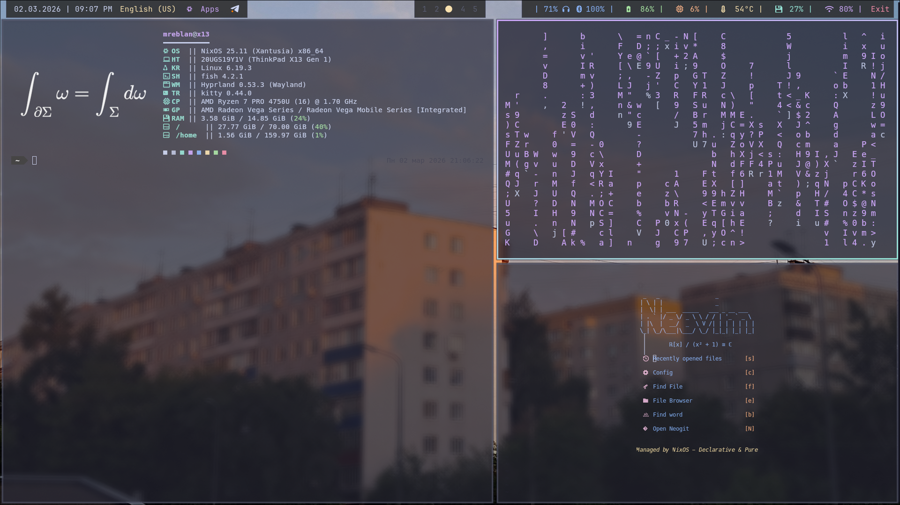
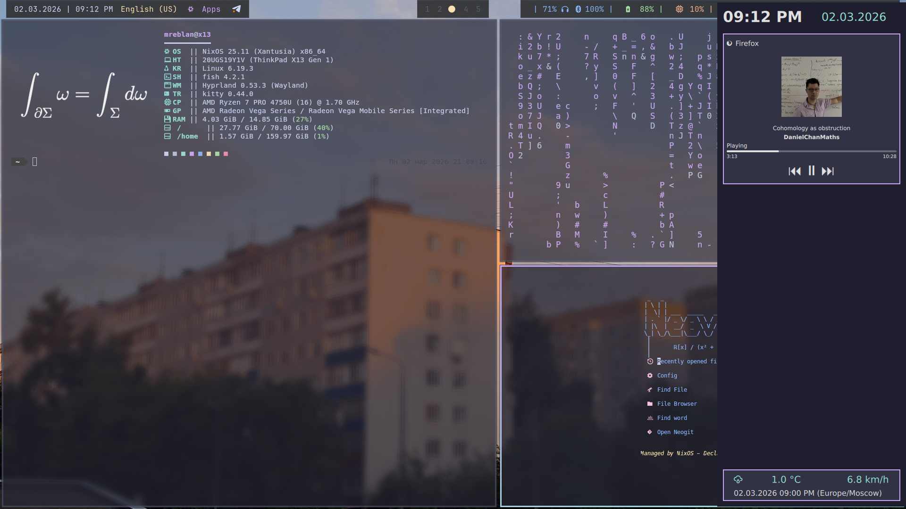

# Dotfiles

NixOS configuration with Niri, managed via Home Manager.




## Structure

- `nixos/` — NixOS flake with all configs
  - `flake.nix` — main entry point
  - `home.nix` — Home Manager configuration
  - `modules/` — NixOS/Home Manager modules (niri, kitty, waybar, etc.)

## Usage

```bash
# Rebuild the system
sudo nixos-rebuild switch --flake ~/dotfiles/nixos#x13

# Rebuild home manager (if needed separately)
home-manager switch --flake ~/dotfiles/nixos#mreblan@x13
```

## Components

- **WM:** Niri with niri-screenshot, niri-wallpaper.sh
- **Bar:** Waybar
- **Launcher:** Wofi
- **Notifications:** Mako
- **Terminal:** Kitty
- **Shell:** Fish with bobthefish theme
- **Editor:** NixVim

## Theme

Catppuccin Mocha (configured in `home.nix`).
